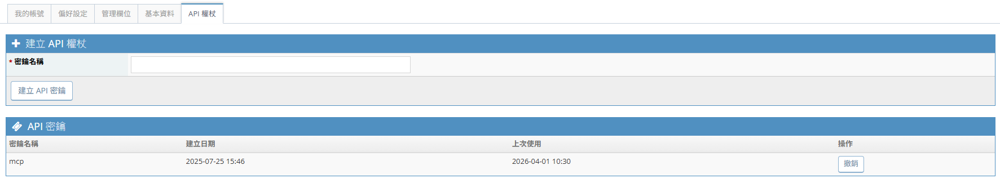

# Mantis Skill

透過 REST API 操作 MantisBT，支援查詢/建立/更新 issue、下載附件圖片、統計分析。
完整 status / 操作規範請直接參考 [SKILL.md](SKILL.md)。

## 前置需求

| 需求             | 說明                                                                                |
| ---------------- | ----------------------------------------------------------------------------------- |
| Node.js runtime  | 需要可執行的 `node` 指令，且版本需為 **18+**（`node <path>/scripts/mantis.js ...`） |
| Mantis API Token | 用於 REST API 認證（所有功能）                                                      |

## 設定

### 步驟一：建立 `.env` 設定檔

```bash
cp ${your-skills-path}/skills/mantis/env.example ${your-skills-path}/skills/mantis/.env
```

編輯 `${your-skills-path}/skills/mantis/.env`，填入實際值：

```env
MANTIS_API_URL=https://<your-mantis-host>/api/rest
MANTIS_API_TOKEN=<your-mantis-api-token>
```

### 步驟二：取得 API Token

1. 登入 Mantis 網站
2. 右上角帳號選單 > **我的帳號**
3. 切換到 **API 權杖** 分頁
4. 輸入密鑰名稱，點擊 **建立 API 密鑰**，複製產生的 token



### 步驟三：驗證連線

```bash
node ${your-skills-path}/skills/mantis/scripts/mantis.js status
```

若 `status` 失敗，請直接依 [SKILL.md](SKILL.md) 的 `reason` taxonomy 判斷下一步；本檔不再維護簡化版狀態表。

## 使用方式

設定完成後，直接在對話中提及 mantis 相關需求即可，skill 會自動觸發。

範例提示：

```
查看 mantis issue #1234 的詳情
幫我列出專案 5 本週未解決的問題
下載 issue #1234 的截圖附件
統計各人員的 issue 分派數量
```

## 快速上手

也可以在終端機直接呼叫腳本；`--filter` 對應 `filter_id`，`--status` 僅保留為相容 alias。

```bash
# 查詢 issue
node ${your-skills-path}/skills/mantis/scripts/mantis.js get-issue 1234

# 列出問題
node ${your-skills-path}/skills/mantis/scripts/mantis.js list-issues --project 5 --filter 50

# 下載附件
node ${your-skills-path}/skills/mantis/scripts/mantis.js list-attachments 1234
node ${your-skills-path}/skills/mantis/scripts/mantis.js download-attachment 1234 <file_id> --output /tmp/screenshot.png
```

完整指令說明與 status taxonomy 請參考 [SKILL.md](SKILL.md)；本檔僅保留快速上手與常見流程。

## 文件分工

配合目前文件分層，建議以以下方式查閱：

- `SKILL.md`：Skill 入口、`status` 規格、CLI 能力總覽與使用約定。
- `references/issue-workflow.md`：issue workflow、USER feedback 流程、附件（attachments）規則。
- `references/metadata-maintenance.md`：metadata store 管理、metadata refresh 流程、stale metadata 判斷與維護方式。

## 常見問題

**Q: Windows 上 `node` 找不到？**
A: 確認 `node` 指令可在終端機執行並已加入 PATH。此 skill 已改為直接透過 `node .../scripts/mantis.js` 執行，不再依賴外層 wrapper 腳本。
